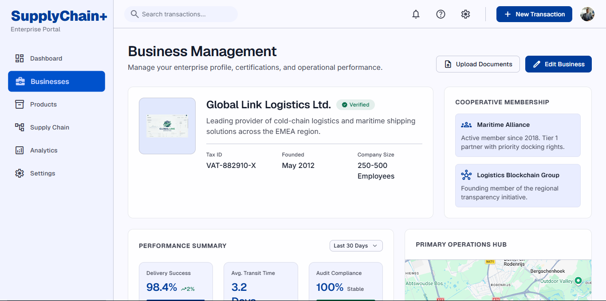
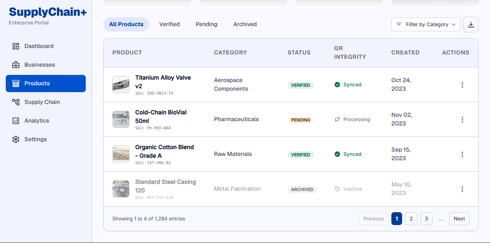
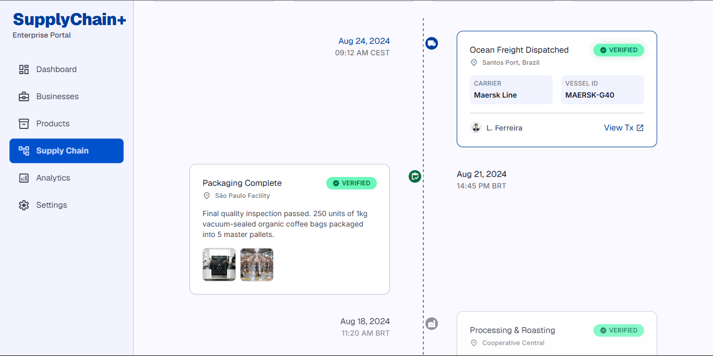
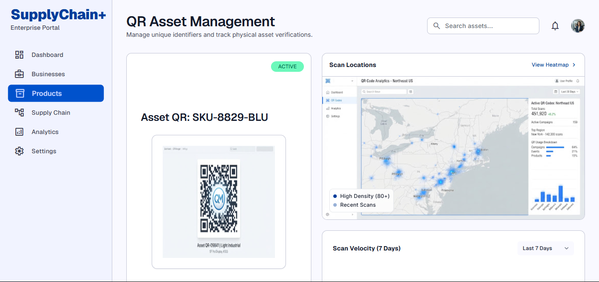
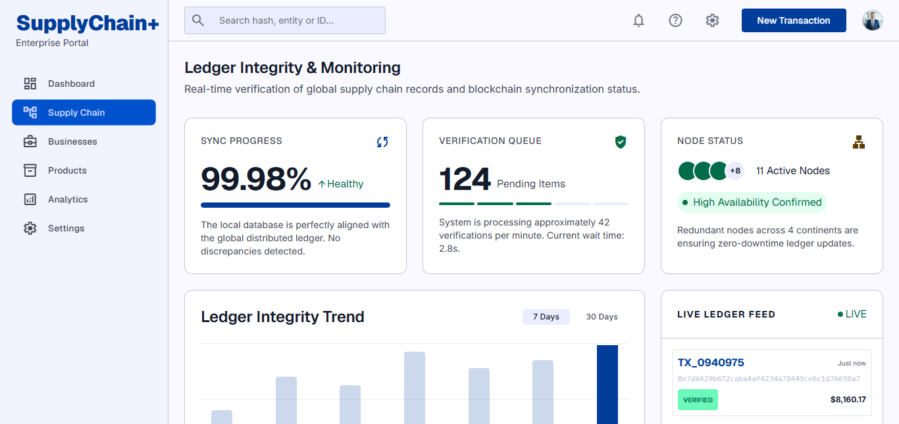
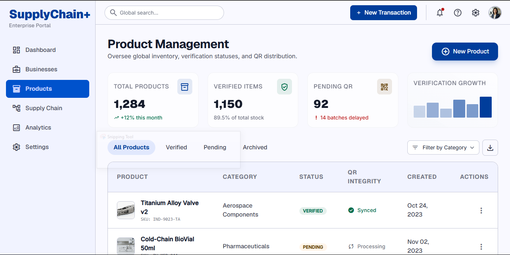

# SupplyChain+
### Blockchain-Based Supply Chain Transparency Platform

A modern enterprise web platform designed to improve supply chain transparency, product traceability, and consumer trust through QR code verification and blockchain technology.
<br>
<br>

## 📖 Overview

SupplyChain+ is a blockchain-enabled supply chain management platform designed to digitize product traceability for women-owned businesses. The platform enables entrepreneurs to register products, monitor their movement across the supply chain, generate secure QR codes, and provide customers with a trusted method of verifying product authenticity.

Unlike traditional supply chain systems that rely on paper documentation or fragmented digital records, SupplyChain+ combines centralized business management with blockchain-backed verification to create a transparent and tamper-resistant ecosystem.

The system has been designed with scalability, usability, and enterprise deployment in mind, making it suitable for cooperatives, SMEs, financial institutions, regulatory organizations, and consumers.

---

# 🚀 Project Objectives

The primary objective of the project is to create a secure and transparent digital platform capable of:

- Registering businesses and entrepreneurs.
- Managing products throughout their lifecycle.
- Recording supply chain events.
- Generating unique QR codes for products.
- Providing blockchain-backed verification.
- Allowing customers to verify product authenticity.
- Providing administrators with centralized oversight.
- Supporting future expansion into enterprise supply chain ecosystems.

---

# 🎯 Problem Statement

Many small and medium-sized enterprises continue to rely on manual record keeping and disconnected information systems, making it difficult to verify product authenticity and monitor supply chain activities.

This creates several challenges:

- Counterfeit products
- Lack of traceability
- Poor consumer trust
- Limited transparency
- Difficult compliance auditing
- Inefficient business reporting

SupplyChain+ addresses these challenges by providing a centralized digital platform supported by blockchain verification.

---

# 🌍 Proposed Solution

SupplyChain+ introduces a web-based platform that integrates modern business management practices with blockchain technology.

The system enables:

- Digital business registration
- Product registration
- Supply chain event recording
- QR code generation
- Product verification
- Business analytics
- Administrative oversight
- Immutable blockchain verification

---

# ✨ Key Features

## Business Management

- Business registration
- Business profile management
- Business verification
- Cooperative membership
- Document management

---

## Product Management

- Product registration
- Product categorization
- Product lifecycle management
- Product inventory
- Product status tracking

---

## Supply Chain Management

- Production tracking
- Distribution tracking
- Transportation history
- Warehouse updates
- Timeline visualization
- Supply chain event management


---

## QR Verification

- Automatic QR generation
- Downloadable QR codes
- Printable QR labels
- Public verification page
- Verification history
- Scan analytics

---

## Blockchain Integration

- Immutable verification records
- Product verification
- Supply chain integrity
- Ledger synchronization
- Transaction monitoring

---

## Analytics & Reporting

- Business Dashboard
- Product statistics
- Supply chain analytics
- Verification reports
- Exportable reports
- Administrative insights

---

## Platform Administration

- User Management
- Cooperative Management
- Role Management
- Reports
- System Monitoring
- Audit Logs

---

# 👥 User Roles & RBAC

The platform supports multiple user roles with corresponding Role-Based Access Control (RBAC):

| Role | System Role Name | Responsibilities |
|-------|------------------|------------------|
| Entrepreneur | `Entrepreneur` | Register businesses, products, and supply chain events |
| Cooperative Administrator | `CooperativeAdmin` | Manage cooperative members and businesses |
| Buyer / Consumer | `Buyer` | Verify product authenticity using QR codes |
| Financial Institution | `FinancialInstitution` | Verify business information for financing purposes |
| Platform Administrator | `PlatformAdmin` | Manage users, reports, and platform operations |

---

# 🏗 System Architecture

## High-Level Architecture

```
                    Users
                      │
        ┌─────────────┼─────────────┐
        │             │             │
  Entrepreneurs   Buyers      Administrators
        │             │             │
        └─────────────┼─────────────┘
                      │
              React Frontend
                      │
                REST API (Express)
                      │
        ┌─────────────┼──────────────┐
        │                            │
 PostgreSQL Database      Hyperledger Fabric
        │                            │
        └─────────────┼──────────────┘
                      │
               QR Verification
```

---

# 🔄 Core Workflow

```
User Registration
        │
        ▼
Business Registration
        │
        ▼
Product Registration
        │
        ▼
Generate QR Code
        │
        ▼
Supply Chain Events
        │
        ▼
Blockchain Verification
        │
        ▼
Customer QR Scan
        │
        ▼
Verified Product Information
```

---

# 🎨 UI/UX Design

The application's user experience has been designed as a modern enterprise Software-as-a-Service platform.

The design follows a unified design system emphasizing:

- Trust
- Transparency
- Simplicity
- Accessibility
- Enterprise-grade usability

The UI has been divided into three major experiences.

## Public Experience

- Landing Page
- Authentication
- Registration
- Password Recovery
- QR Verification


---

## Business Platform

- Dashboard
- Product Management
- Supply Chain
- QR Management
- Analytics
- Reports


---

## Administration Platform

- User Management
- Cooperative Management
- Reports
- Platform Monitoring
- System Health
- Platform Settings


---

# ⚙ Backend Architecture & Stack

The backend follows a modular enterprise architecture using Express.js.

### Technical Stack

* **Runtime**: Node.js
* **Backend Framework**: Express.js
* **API Documentation**: OpenAPI 3.1 & Swagger UI Express
* **Request Validation**: Joi
* **Authentication**: JWT & Role-Based Access Control (RBAC)
* **Security & Logging**: Helmet, CORS, Morgan

Major modules include:

- Authentication
- Users
- Businesses
- Products
- Supply Chain
- QR Codes
- Product Verification
- Analytics
- Reports
- Cooperatives
- Notifications
- Administration
- Blockchain Services

Each module follows a layered architecture:

```
Routes
   │
Controllers
   │
Services
   │
Repositories
   │
Database
```

---

# 📡 API Design & Documentation

The backend exposes a versioned REST API prefix-routed through:

```
/api/v1/
```

The API is documented using the OpenAPI 3.1 specification.

Interactive Swagger documentation is available at:

* **Swagger UI URL**: [http://localhost:3000/api/docs](http://localhost:3000/api/docs)
* **API Health Check**: [http://localhost:3000/status](http://localhost:3000/status)

The API includes JWT Authorization, validation (Joi), and standardized response formats.

[Swagger Screenshot]

---

# 🗄 Database

The platform uses PostgreSQL as the primary relational database.

Core entities include:

- Users
- Businesses
- Products
- Product Categories
- Supply Chain Events
- Cooperatives
- QR Codes
- Verification Records
- Reports
- Notifications

[ER Diagram]

---

# 🔐 Security

Security considerations include:

- JWT Authentication
- Role-Based Access Control (RBAC)
- Password Hashing (bcrypt)
- Input Validation (Joi)
- Secure API Design (Helmet, CORS)
- Audit Logging
- Blockchain Verification

---

# 📂 Repository Structure

The current codebase is structured under the following layout:

```
alu-blockchain/
├── src/                # Backend source code
│   ├── config/         # Application environment and config loader
│   ├── middleware/     # Auth, RBAC, Validation, and Global Error handlers
│   ├── routes/         # API routing configurations mapped to controllers
│   ├── controllers/    # Request handling and response formatting
│   ├── services/       # Business logic implementation placeholders
│   ├── repositories/   # Core database/blockchain mock stores
│   ├── utils/          # Helper utilities (auth, standard responses, custom errors)
│   ├── docs/           # Auto-generated openapi.json documentation specs
│   ├── generate-docs.js# Script to dynamically compile openapi.json
│   ├── app.js          # Express application initializer
│   └── server.js       # Server runner entry point
├── .env                # Environment variables configuration
├── package.json        # Project dependencies and scripts
└── README.md           # Project documentation
```

---

# 🚀 Running the Application

### 1. Install Dependencies

```bash
cd backend
npm install
```

---

### 2. Configure Environment

Copy `.env.example` to `.env` and fill in your local values:

```bash
cp .env.example .env
```

Key variables to configure:

| Variable | Description |
|---|---|
| `DATABASE_URL` | PostgreSQL connection string |
| `JWT_SECRET` | Strong random secret — `node -e "console.log(require('crypto').randomBytes(64).toString('hex'))"` |
| `JWT_REFRESH_SECRET` | Separate strong random secret |
| `CORS_ORIGIN` | Your frontend URL (e.g. `http://localhost:5173`) |
| `API_BASE_URL` | This server's URL (e.g. `http://localhost:3000`) |

> ⚠️ Never commit your `.env` file — it is excluded by `.gitignore`.

---

### 3. Set Up the Database

Ensure PostgreSQL is running, then apply all Prisma migrations:

```bash
npx prisma migrate dev

# Optional: seed initial platform data
npm run db:seed
```

---

### 4. Run the Development Server

```bash
npm run dev
```

The API will be available at:

| Endpoint | URL |
|---|---|
| REST API | `http://localhost:3000/api/v1` |
| Swagger UI | `http://localhost:3000/api/docs` |
| Health Check | `http://localhost:3000/api/v1/health` |

---

### 5. Run Tests

```bash
# Run the full test suite
npm test

# Run a specific module's tests
npm test -- --testPathPattern=auth
```

The suite includes **253 tests across 24 files** covering every module:

| Type | What It Tests |
|---|---|
| **Unit** | Service business logic with mocked repositories |
| **Integration** | Full HTTP request/response lifecycle via Express |
| **Validation** | Joi schema rules for every endpoint |

---

### 6. Deploy to Production (Render)

All deployment configuration is in [`render.yaml`](render.yaml) at the repo root.

**Render Dashboard — required environment variables:**

| Variable | Notes |
|---|---|
| `DATABASE_URL` | Auto-injected when a Render PostgreSQL service is linked |
| `JWT_SECRET` | 64-byte hex secret — generate locally, never commit |
| `JWT_REFRESH_SECRET` | Separate 64-byte hex secret |
| `CORS_ORIGIN` | Frontend Render URL (e.g. `https://your-app.onrender.com`) |
| `API_BASE_URL` | This service's Render URL (used by Swagger) |

**Render build & start commands** (already set in `render.yaml`):

```
Build:  npm install && npm run build
Start:  npm start
```

---

# 📊 Project Progress

| Phase | Status |
|--------|--------|
| Research Proposal | ✅ Complete |
| Requirements Analysis | ✅ Complete |
| Software Architecture | ✅ Complete |
| UI/UX Design | ✅ Complete |
| Backend Architecture | ✅ Complete |
| API Planning | ✅ Complete |
| OpenAPI Specification | ✅ Complete |
| Database Design | ✅ Complete |
| Backend Development | ✅ Complete |
| Blockchain Integration | ✅ Complete |
| Testing | ✅ Complete |
| Frontend Development | ⏳ Pending |
| Deployment | ⏳ Pending |

---

# 🛣 Development Roadmap

## Phase 1 — Planning & Architecture ✅

- Requirements Analysis
- System Design
- UI/UX Design
- Backend Planning
- API Planning

---

## Phase 2 — Backend Development ✅

- Express API
- Authentication
- PostgreSQL Integration
- Swagger
- API Implementation

---

## Phase 3 — Blockchain Integration ✅

- Hyperledger Fabric
- Transaction Verification
- Smart Contracts
- Ledger Synchronization

---

## Phase 4 — Backend Testing ✅

- Unit Testing
- Integration Testing
- API Testing
- User Acceptance Testing

---

## Phase 5 — Frontend Development

- React Application
- Dashboard
- Product Management
- Analytics
- Reports

## Phase 6 — Deployment

- Production Build
- Cloud Deployment
- Monitoring
- Documentation
- Final Presentation

---

# 🎥 Demonstration

A walkthrough demonstrating the current project planning, UI design concepts, and backend architecture is available below.

**Project Demonstration**

https://canva.link/oc8zr7ph76bf5ez

---

# 🛠 Future Enhancements

Potential future enhancements include:

- Mobile application
- AI-powered supply chain insights
- Offline synchronization
- Multi-language support
- IoT integration
- Predictive analytics
- Advanced reporting
- SMS and email notifications
- Third-party ERP integrations

---

# 📄 License

This repository represents an academic capstone project developed as part of the Bachelor of Information Technology programme.

The project is intended for educational, research, and demonstration purposes.

---

# 🤝 Acknowledgements

This project is being developed as part of a university dissertation focused on leveraging blockchain technology to improve supply chain transparency and trust for women-owned businesses.

Special appreciation is extended to the project supervisors, academic institution, and stakeholders whose guidance contributes to the successful completion of this work.

---

> **Current Status:** The project has successfully completed its architecture, planning,design, and backend implementation phases. Development is now transitioning into frontend implementation.
